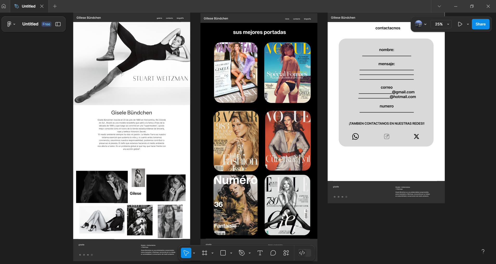

# Sitio Tributo a Gisele Bündchen

Un sitio web minimalista y responsive que celebra a la icónica supermodelo Gisele Bündchen, destacando su carrera, logros y legado en la industria de la moda.

**Demo en vivo:** [souchies.github.io/bit-1/](https://souchies.github.io/bit-1/)

## Diseño

##  Características
- **Biografía completa**: Línea de tiempo de su vida y carrera
- **Galería interactiva**: Selección de sus fotos más emblemáticas
- **Diseño elegante**: Estética en blanco y negro con efectos CSS modernos
- **Totalmente responsive**: Adaptado a móviles, tablets y desktop
- **Formulario funcional**: Sistema de contacto 

##  Tecnologías Utilizadas
- **Frontend**: HTML5, CSS, JavaScript 
- **Diseño**: Figma 
- **Hosting**: GitHub Pages

##  Estructura del Proyecto
bit-1/
- `index.html`: Página principal  
- `biografia.html`: Biografía detallada
- `galeria.html`: Galería de fotos
- `contacto.html`: Formulario de contacto 
- `bio.css`: Estilos específicos de biografía   
- `style.css`: Estilos generales 
- `galeria.css`: Estilos específicos de galería
- `bio.js` : Funcionalidades de biografía
- `galeria.js` : Funcionalidades de galería
- `assets` : Imágenes y recursos
- `README.md`: Descripción del proyecto 

##  Filosofía de Diseño
- **Paleta de colores**: Monocromática (blanco/negro) para elegancia atemporal
- **Tipografía**: Fuentes limpias inspiradas en revistas de moda
- **Reto técnico**: Implementación del botón de scroll-to-top
- **Elemento destacado**: Barra de navegación animada

##  Autora
_Eileen Sofía Jerónimo Camargo_
BIT Academy - 2025  
[Portafolio](#https://github.com/souchies) 

##  Academia
Desarrollado como parte del programa de [BIT Academy](https://www.bit.institute/)

---

> *"La belleza comienza en el momento en que decides ser tú misma"* — Gisele Bündchen